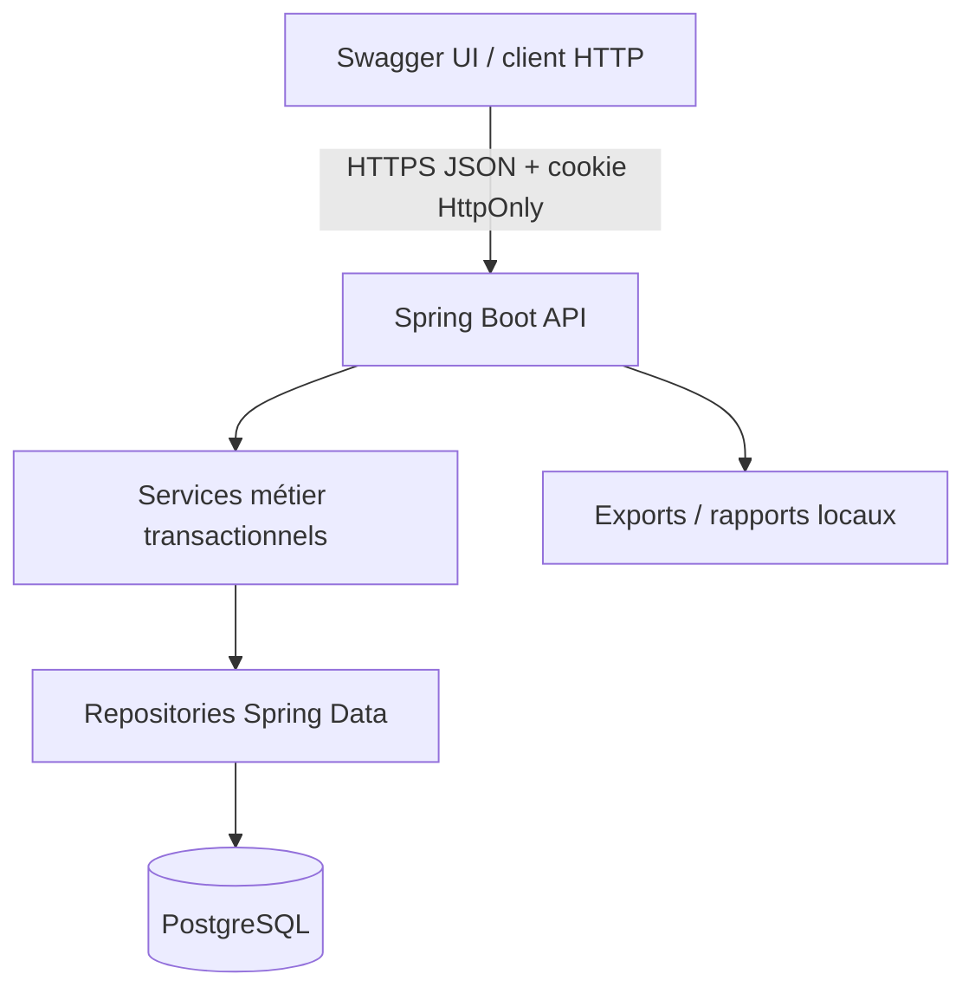
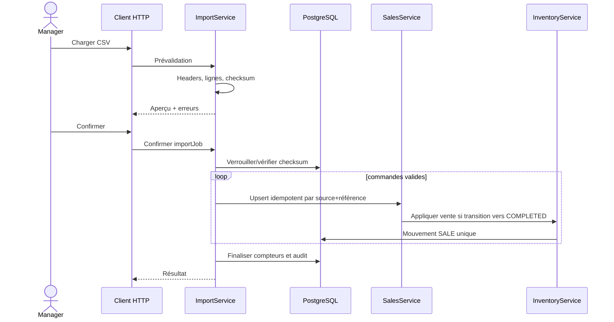
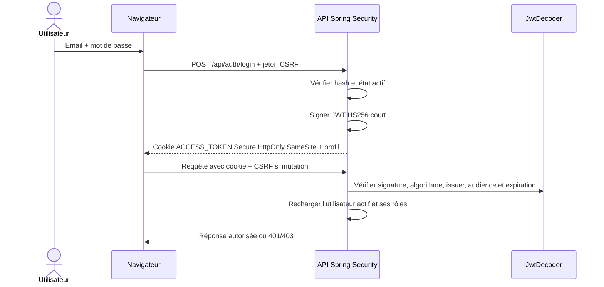
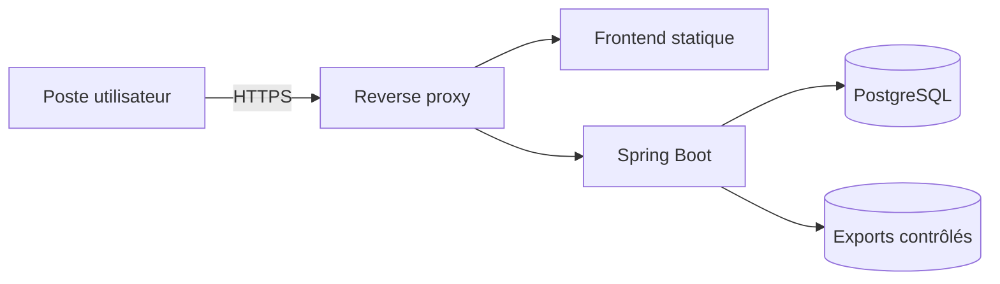

# Architecture

## Architecture frontend

Le client vit dans `frontend/`. `src/app/router.tsx` déclare les routes et les gardes de rôle; `AppLayout` conserve le shell latéral approuvé. `AuthProvider` restaure `/api/auth/me` au chargement. Les modules de `src/api` sont les seules portes d’entrée HTTP et les pages les consomment avec TanStack Query. Les DTO Java sont reflétés explicitement dans `src/types/api.ts`; aucune entité JPA n’est exposée.

Les états de formulaire locaux restent dans React Hook Form et Zod. Les données serveur, la pagination et l’invalidation vivent dans TanStack Query. Les calculs KPI, stock, commandes, prévisions et recommandations restent exclusivement côté backend.

## Style retenu

Maarif Analytics est un monolithe backend en couches déployé comme une API Spring Boot avec PostgreSQL. Swagger UI fournit le client de démonstration technique. Les transactions de commande, import et stock restent locales et atomiques.

## Couches backend

| Package | Responsabilité | Dépendances principales |
|---|---|---|
| `controller` | Endpoints HTTP, validation d'entrée et statuts HTTP | DTO, services |
| `dto` | Contrats d'entrée/sortie de l'API | types Java simples |
| `service` | Règles métier, cas d'utilisation et transactions | repositories, modèles, mappers |
| `repository` | Requêtes et persistance Spring Data | modèles |
| `model` | Entités JPA et invariants locaux | Jakarta Persistence/Validation |
| `mapper` | Conversion explicite modèle/DTO | modèles, DTO |
| `exception` | Erreurs métier et réponse HTTP structurée | DTO |
| `config` | Configuration technique Spring/OpenAPI | infrastructure |

Le sens principal des dépendances est `controller -> service -> repository -> model`. Un contrôleur ne contacte jamais directement un repository et aucune entité JPA n'est exposée comme contrat HTTP. Les fonctionnalités restent séparées par leurs services et leurs noms de classes plutôt que par des packages métier imbriqués.

### Catalogue implémenté au jalon 2

Les entités catalogue résident dans `model`, leurs interfaces Spring Data dans `repository`, leurs règles transactionnelles dans `service`, leurs conversions dans `mapper`, leurs contrats validés dans `dto` et leurs endpoints dans `controller`. Les référentiels disposent de listes paginées et de créations contrôlées; le produit les référence par identifiant. Le contrôleur reste mince et la désactivation remplace toute suppression physique d'un produit.

## Flux d'import cible

## Authentification JWT

## Déploiement cible

## Décisions transversales

- UTC pour les instants persistés; `Africa/Casablanca` pour les dates métier et présentations.
- Agrégats/calculs financiers uniquement au backend.
- Identifiants techniques `bigint`; références métier explicites et contraintes uniques.
- Stock courant dérivé de la somme des mouvements; une projection optimisée ne sera ajoutée qu'avec invariant et réconciliation.
- Base HTTP `/api`; une version de chemin sera introduite seulement si un contrat public ou une rupture de compatibilité la justifie. L'endpoint `/api/platform` reste un diagnostic non sensible.
