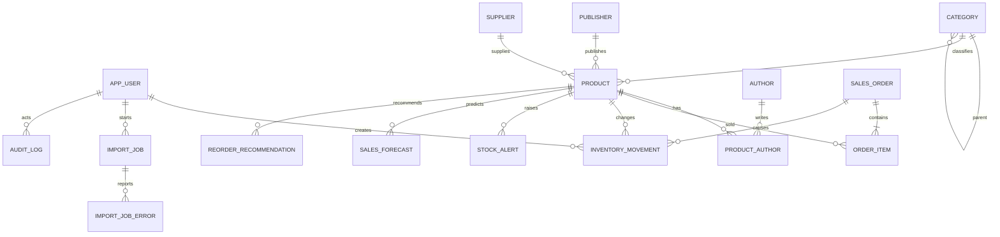

# Conception de la base de données

## Principes

PostgreSQL est la base de référence. Flyway applique les migrations au démarrage. Les montants sont `numeric(19,2)`, quantités `integer`, instants `timestamp with time zone`. Les suppressions historiques sont évitées au profit de statuts actifs.

## Invariants portés par le schéma initial

- `product.sku` unique et `isbn` unique quand présent (PostgreSQL autorise plusieurs `NULL`).
- `sales_order(source, external_reference)` unique.
- `import_job(import_type, file_checksum)` unique.
- Les montants et quantités métier sont bornés par des contraintes `CHECK`.
- Un mouvement lié à une vente est unique par commande, produit et type; le service agrégera les lignes identiques avant écriture.
- Les sens des mouvements standards sont contrôlés: entrées positives, sorties négatives, correction non nulle.
- Une recommandation, une alerte et une prévision conservent leur explication.

## Stock

Le stock disponible initial est la somme de `inventory_movement.quantity` par produit. Cette approche privilégie l'audit et évite la divergence entre une colonne de stock et son journal. Les écritures futures verrouilleront le produit dans une transaction, calculeront le nouveau total et appliqueront RM-01.

## Idempotence

Trois barrières complémentaires sont prévues:

1. checksum unique du fichier confirmé;
2. référence externe unique dans une source;
3. mouvement de vente unique lié à la commande et au produit.

Le service reste responsable de retourner un résultat idempotent compréhensible; une violation SQL n'est pas exposée brute.

## Migrations actuelles

- `V1__create_initial_schema.sql`, désormais immuable, crée toutes les tables métier principales.
- `V2__add_settings_and_import_payload.sql` ajoute `app_setting` et le contenu CSV temporaire nécessaire entre aperçu et confirmation. Le contenu est effacé après confirmation.

Toutes les tables V1 et V2 sont reliées à des entités JPA explicites. `ddl-auto=validate` interdit à Hibernate de modifier le schéma et détecte les divergences avec Flyway.

Les associations catalogue sont chargées en `LAZY` par défaut. Le repository produit emploie un `EntityGraph` uniquement pour les lectures qui ont besoin du graphe complet, afin d'éviter à la fois le N+1 et le chargement systématique.
