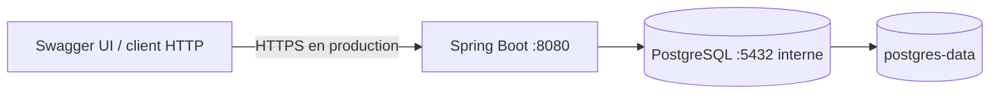

# Déploiement

## Frontend

Le service `frontend` de Docker Compose construit l’application Vite puis sert `dist/client` avec Nginx sur le port `5173`. Nginx renvoie les routes inconnues vers `index.html` et proxifie `/api/` vers `backend`, ce qui conserve les cookies de session sur la même origine. Le build Sites reste disponible via `npm run build` et `npm run test:sites`.

## Docker Compose

1. Installer Java 21 et Docker Engine/Compose.
2. Copier `.env.example` vers `.env` et remplacer tous les secrets d'exemple.
3. Exécuter `docker compose up --build`.
4. Vérifier `http://localhost:8080/actuator/health` et `http://localhost:8080/swagger-ui.html`.

Le service PostgreSQL utilise `pg_isready`; le backend attend sa santé et expose son propre health check. Aucun port PostgreSQL ne doit être publié en production.

## Production

- Reverse proxy HTTPS; `SESSION_COOKIE_SECURE=true`.
- `DEMO_DATA_ENABLED=false`; le chargeur synthétique ne doit pas être exposé.
- Secrets injectés par l'environnement ou fichiers protégés, jamais committés.
- Sauvegardes PostgreSQL chiffrées et restauration testée.
- Une migration Flyway appliquée n'est jamais modifiée; correction additive uniquement.
- Logs centralisés sans données sensibles et politique de rotation.
- Spring Session JDBC ou Redis uniquement si plusieurs instances deviennent nécessaires.

Arrêt normal: `docker compose down`. Ne pas employer `--volumes` sauf intention explicite de supprimer les données locales.
