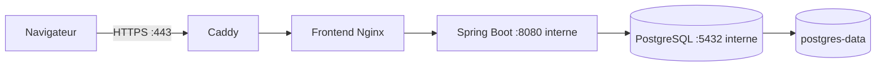

# Déploiement

## Frontend

Le service `frontend` construit l’application Vite puis sert `dist` avec Nginx sur le réseau Compose privé. Nginx renvoie les routes inconnues vers `index.html` et proxifie `/api/` vers `backend`, ce qui conserve les cookies de session sur la même origine. Caddy est l’unique point d’entrée public sur les ports 80 et 443 et gère automatiquement HTTPS pour `APP_DOMAIN`.

## Docker Compose

1. Installer Java 21 et Docker Engine/Compose.
2. Faire pointer `APP_DOMAIN` vers le VPS, copier `.env.example` vers `.env` et remplacer tous les secrets d'exemple.
3. Sur le VPS, exécuter `docker compose up --build`. Pour conserver les ports locaux de développement, utiliser aussi `-f docker-compose.dev.yml`.
4. Vérifier `https://<APP_DOMAIN>/api/platform` puis la santé interne avec `docker compose exec backend curl --fail --silent http://localhost:8080/actuator/health`.

PostgreSQL utilise `pg_isready`; le backend attend sa santé, le frontend attend celle du backend et Caddy attend celle du frontend. Aucun port PostgreSQL ou backend n’est publié sur l’hôte.

## Variables d’environnement de production

Compose force le profil Spring `prod`, le cookie JWT sécurisé et l’origine HTTPS dérivée de `APP_DOMAIN`. Fournir `APP_DOMAIN`, `ACME_EMAIL`, `POSTGRES_PASSWORD`, `JWT_SECRET` et les identifiants du premier administrateur dans un fichier `.env` protégé, jamais dans l’image ou le dépôt.

Le limiteur embarqué protège une instance. Avant toute réplication horizontale, le remplacer par une politique partagée (Redis ou passerelle API). Configurer PostgreSQL en réseau privé, TLS, avec un rôle Flyway propriétaire séparé d’un rôle applicatif sans droit DDL. Brancher également un service d’analyse antimalware selon la politique de téléversement retenue.

La procédure complète pour Hostinger, y compris DNS, sauvegarde et dépannage, se trouve dans [Déploiement sur un VPS Hostinger](hostinger-vps-deployment.md).

## Production

- Reverse proxy HTTPS; le profil `prod` force le cookie JWT `Secure`.
- `DEMO_DATA_ENABLED=false`; le chargeur synthétique ne doit pas être exposé.
- Secrets injectés par l'environnement ou fichiers protégés, jamais committés.
- Sauvegardes PostgreSQL chiffrées et restauration testée.
- Une migration Flyway appliquée n'est jamais modifiée; correction additive uniquement.
- Logs centralisés sans données sensibles et politique de rotation.
- Partager le même `JWT_SECRET` entre instances; Redis n’est utile que pour distribuer le limiteur de débit ou un futur cache.

Arrêt normal: `docker compose down`. Ne pas employer `--volumes` sauf intention explicite de supprimer les données locales.
