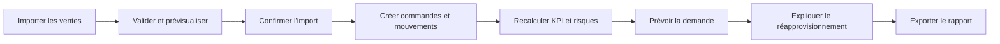

# User stories et cas d'utilisation

## Administrateur

- En tant qu'administrateur, je gère les comptes et rôles afin de contrôler les accès.
- Je configure les références et paramètres afin d'adapter le système au magasin.
- J'importe les ventes et consulte les audits afin de vérifier les traitements.

## Manager

- En tant que manager, je filtre les KPI afin d'expliquer une période de vente.
- Je consulte les risques de rupture et recommandations afin de préparer un réapprovisionnement.
- J'acquitte ou résous une alerte avec justification afin de suivre la décision.
- J'exporte un rapport afin de partager une synthèse de gestion.

## Employé de stock

- En tant qu'employé, je consulte le stock disponible afin de répondre à une demande.
- J'enregistre une livraison, un retour, un dommage ou une correction afin que le stock reste traçable.
- Je consulte les alertes de stock autorisées sans voir les indicateurs financiers sensibles.

## Cas transversal de démonstration

## Critères d'acceptation globaux

- Une action interdite reçoit `403` même si l'interface est contournée.
- Une validation échouée donne un message français exploitable sans détail interne.
- Les écrans de listes offrent pagination, filtres, chargement, vide et erreur.
- Les dates sont lisibles au fuseau de Casablanca et les montants en MAD.

